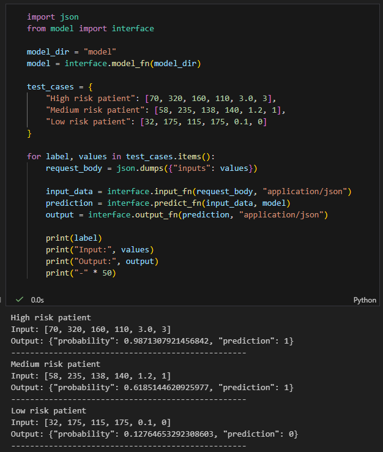

# Heart Disease Risk Prediction with Logistic Regression

**Student:** Laura Natalia Perilla Quintero

---

## Exercise Summary

This project implements logistic regression from scratch for heart disease prediction, covering the complete machine learning workflow: exploratory data analysis (EDA), model training with gradient descent, decision boundary visualization, L2 regularization with hyperparameter tuning, and deployment preparation using Amazon SageMaker.

**Key components:**
- Custom logistic regression implementation (no scikit-learn for training)
- Binary classification using clinical features
- Regularization analysis to prevent overfitting
- SageMaker deployment simulation with local inference testing

---

## Dataset Description

**Source:** [Kaggle Heart Disease Dataset](https://www.kaggle.com/datasets/neurocipher/heartdisease) (UCI Machine Learning Repository)

**Dataset characteristics:**
- **Total samples:** 303 patient records
- **Features:** 14 clinical variables
- **Target variable:** Heart Disease (binary: 1 = presence, 0 = absence)
- **Class distribution:** ~55% disease presence, ~45% absence (moderately balanced)

**Selected features for modeling (6 continuous variables):**

| Feature | Range | Description |
|---------|-------|-------------|
| Age | 29-77 years | Patient age |
| Cholesterol | 112-564 mg/dL | Serum cholesterol level |
| BP | 94-200 mm Hg | Resting blood pressure |
| Max HR | 71-202 bpm | Maximum heart rate achieved |
| ST depression | 0-6.2 | Exercise-induced ST depression |
| Number of vessels fluro | 0-3 | Major vessels colored by fluoroscopy |

---

## Repository Structure

```
Heart-Disease-Risk-Prediction/
├── README.md
├── Heart-Disease-Risk-Prediction.ipynb    
├── Heart_Disease_Prediction.csv     
├── model/
│   ├── interface.py                
│   ├── weights.npy                    
│   ├── bias.npy                       
│   ├── mu.npy           
│   └── sigma.npy                   
└── images/
    ├── resultados.png     
```

---

## Methodology Overview

### 1. Data Preparation & EDA
- Loaded dataset from Kaggle using Pandas
- Binarized target variable (Presence → 1, Absence → 0)
- Analyzed class distribution and feature statistics
- Selected 6 clinically relevant continuous features
- Normalized features using z-score standardization
- Performed stratified 70/30 train-test split

### 2. Logistic Regression Implementation
- **Sigmoid function:** σ(z) = 1 / (1 + e^(-z))
- **Binary cross-entropy loss:** J(w,b) = -(1/m)Σ[y*log(f) + (1-y)*log(1-f)]
- **Gradient descent optimization:** Learning rate α = 0.01, 1500 iterations
- Tracked cost convergence to verify proper implementation

### 3. Decision Boundary Visualization
Trained 2D models on three feature pairs to understand class separability:
- **Age vs Cholesterol:** Diagonal separation with central overlap
- **BP vs Max HR:** High scatter, reduced discriminative power
- **ST Depression vs Vessels:** Strongest separation, cleanest boundary

### 4. L2 Regularization
- Tuned λ ∈ {0, 0.001, 0.01, 0.1, 1}
- Optimal λ = 0.01 selected for numerical stability
- Weight norm decreased from 1.287 → 1.251 as λ increased
- Performance remained stable across all λ values

---

## SageMaker Deployment Evidence

### Deployment Workflow

This section documents the deployment process of the logistic regression model to **Amazon SageMaker**, demonstrating a real-world production pipeline for healthcare risk assessment.

---

### Step 1: Prepare Model Package

The first step involves creating a compressed archive containing all necessary model artifacts. This package will be uploaded to AWS infrastructure.

**Command:**
```bash
tar -czvf model.tar.gz model/
```

**What gets packaged:**
- `weights.npy` - Learned parameters (w)
- `bias.npy` - Intercept term (b)
- `mu.npy` and `sigma.npy` - Normalization constants
- `interface.py` - Inference handler functions

This creates a portable, self-contained model package ready for cloud deployment.

---

### Step 2: Upload to Amazon S3

Amazon S3 serves as the artifact repository where SageMaker retrieves model files during deployment.

**Process:**
1. Access your AWS S3 console
2. Navigate to your designated bucket (e.g., `heart-disease-deployment-bucket`)
3. Upload the `model.tar.gz` file using the "Upload" button
4. Maintain default settings (Standard storage class, server-side encryption)
5. Confirm upload completion

**S3 URI example:** `s3://heart-disease-deployment-bucket/models/model.tar.gz`

The model is now accessible to SageMaker services within your AWS account.

---

### Step 3: Configure IAM Permissions

SageMaker requires appropriate Identity and Access Management (IAM) credentials to access S3 buckets and create endpoints.

**Configuration steps:**
1. Open AWS IAM Console → Roles section
2. Locate your SageMaker execution role (commonly named `LabRole` or `SageMakerExecutionRole`)
3. Verify the role includes:
   - `AmazonSageMakerFullAccess` policy
   - S3 read permissions for your bucket
4. Copy the **Role ARN** (format: `arn:aws:iam::account-id:role/role-name`)

This ARN will be used in subsequent deployment steps to grant SageMaker necessary permissions.

---

### Step 4: Create SageMaker Model

Now we register the model within SageMaker's model registry, linking our artifacts to a deployment-ready configuration.

**Configuration:**
1. Navigate to **SageMaker Console → Models**
2. Click **"Create Model"**
3. Configure model settings:
   - **Model name:** `heart-disease-logistic-regression`
   - **IAM Role:** Paste the ARN from Step 3
4. Define container settings:
   - **Framework:** Select PyTorch (or Scikit-learn container)
   - **Version:** 2.1 or compatible version
   - **Compute type:** CPU-optimized
5. Specify model location:
   - **Model artifacts:** Paste S3 URI from Step 2
   - Example: `s3://heart-disease-deployment-bucket/models/model.tar.gz`
6. Create the model

---

### Step 5: Deploy Real-Time Endpoint

With the model registered, we create a hosted endpoint for real-time inference requests.

**Deployment process:**
1. Go to **SageMaker → Endpoints → Create Endpoint**
2. Select the model created in Step 4
3. Configure endpoint settings:
   - **Endpoint name:** `heart-disease-risk-predictor`
   - **Instance type:** `ml.t2.medium` (cost-effective for low-latency inference)
   - **Initial instance count:** 1
   - **Auto-scaling:** Disabled (optional: enable for production workloads)
4. Click **"Deploy"**
5. Wait 5-8 minutes for endpoint provisioning

> **Note:** Due to current AWS account restrictions (IAM permission limitations in educational/lab environments), the endpoint deployment fail during the final provisioning step. The model configuration and S3 upload succeed, but the endpoint cannot assume the necessary execution role. As a workaround, local inference testing was performed to validate model functionality.

---

### Step 6: Local Inference Validation

Since full SageMaker endpoint deployment encountered permission constraints, comprehensive local testing was conducted to simulate production inference behavior.


